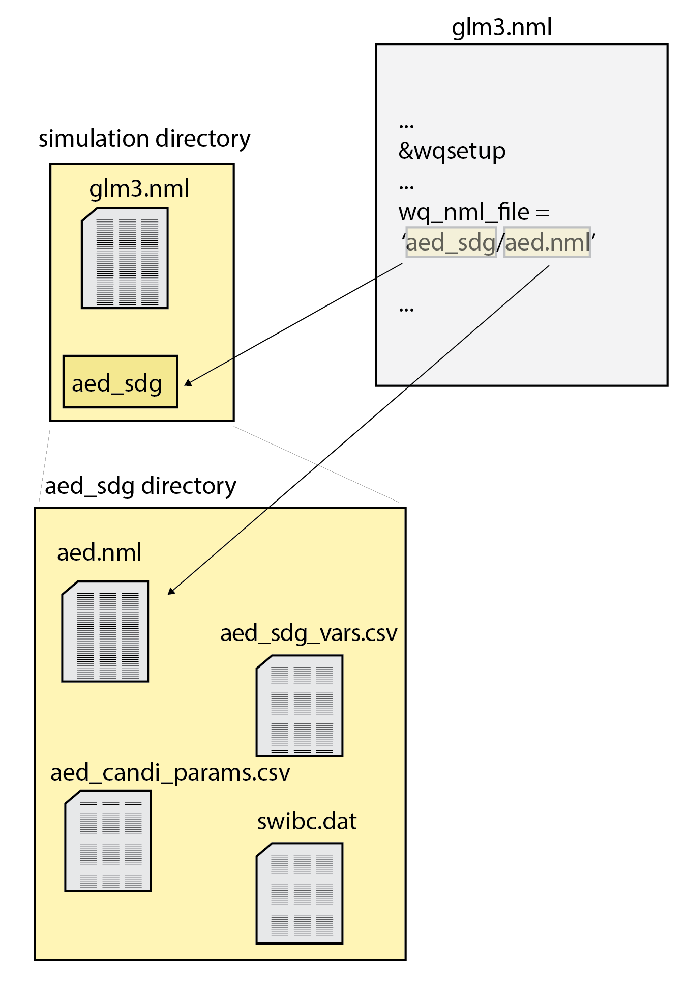

# Readme
## Access the binary

Find the latest model binary at this location

<https://github.com/AquaticEcoDynamics/releases/tree/main/GLM-AED/3.3.x>

To run GLM in Windows, go to the 'windows' directory and get the binary named 'glm+' that was committed most recently. To run GLM on Linux, go to the 'ubuntu' directory and get the binary named 'glm+' that was committed most recently.

## Run GLM 

For instructions on running GLM, please see this workbook:

<https://aquaticecodynamics.github.io/glm-workbook/>

## GLM file structure 

The GLM simulation directory contains the main control file 'glm3.nml'.

This file has a section for setting the water quality models. The water quality model parameter will be set to 'aed.nml', which is in the 'aed_sdg' subdirectory.

The 'aed.nml' contains a section that sets the parameters for the sediment model, with the heading '&aed_sed_candi'. Parameters are listed in this section that control some model settings. The '&aed_sed_candi' section also lists the paths and names of other input files, such as those for the the variables, parameters and boundary conditions.

1
