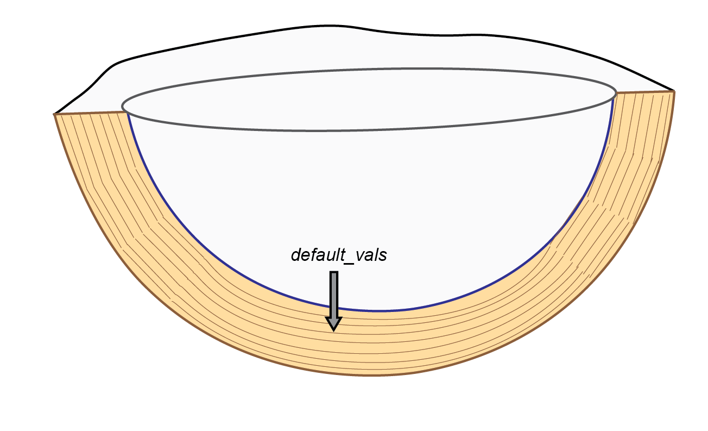

# Get started with this simulation

This folder contains a CANDI-AED simulation as part of a General Lake Model (GLM) simulation. It is set up to be a general marine sediment, though not any specific study site, and the lake's water column is not the focus of this exercise. The focus is to set up the workflow correctly, according to the following steps:

- Download the GLM model binary file
- Examine the CANDI-AED setup using Visual Studio Code or a text editor
- Run the GLM model from this simulation directory
- Create a plot of the results 

## Access the GLM binary

The GLM binary is the computer program that runs the lake simulation. You can find the latest model binary at this location

<https://github.com/AquaticEcoDynamics/releases/tree/main/GLM-AED/3.3.x>

To run GLM in Windows, go to the 'windows' directory and get the binary named 'glm+' that was uploaded most recently. 
To run GLM on Linux, go to the 'ubuntu' directory and get the binary named 'glm+' that was uploaded most recently.

Since we are using CANDI-AED, which is an advanced feature, we need to use 'glm+' rather than 'glm'.

## Run GLM 

This simulation is configured to run the GLM lake model as a host for the sediment model, however, dynamic coupling is disabled. The lake outputs of GLM can be disregarded for the focus and the focus is on the sediment results. 

GLM is called from this folder (1_simple_example), where the file 'glm3.nml' is, and GLM needs to reference the directory on your computer where the binary 'glm+.exe' is located. 

If you are using Windows, set the path from the simulation directory to the binary inside the batch file 'run_glm.bat'.
If you are using Linux, navigate to this simulation directory, then call the binary from here, starting with './', for example, './../../releasebinary\windows\glm+_3.3.1\glm+_3.3.1\glm+.exe'.

For general instructions on running GLM, please see this workbook:

<https://aquaticecodynamics.github.io/glm-workbook/>

## The sediment model

A full description of the sediment model is given here:

https://aquaticecodynamics.github.io/aed-science/sediment-biogeochemistry.html

To view the settings of GLM or CANDI-AED open the VSC file 'candi-examples_setup'. 

This example is generally similar to a marine sediment, based on the following settings:

- low organic matter
- marine salinity and SO_4^{2-} concentration
- high porosity
- bioturbation and bioirrigation

## Plotting

To create a plot, use the VSC file 'candi-examples_results' and install the RStudio extension. Open the file 'SixPlotsCandi-Examples.R' from the 'R' folder and run the whole file. This .R file calls the other .R files in the 'R' directory. There may be some errors while installing packages, however, once this is overcome, the script should run efficiently in VSC. As an alternative, use the RStudio project in the 'R' folder and run 'SixPlotsCandi-Examples.R' line by line or as needed. 

Once plot, the figure will look like this:

## GLM-SDG file structure 

You may notice that you are looking at a lot of model folders and files. If you would like to understand how the folders and files are structured, an overview is given below. 

The GLM simulation directory contains the main control file 'glm3.nml'.

This glm.nml file has a section for setting the water quality models, &wq_setup. The parameter 'wq_lib' is set to 'aed' and the 'wq_nml_file' is set to 'aed.nml', which is in the 'aed_sdg' subdirectory.

The 'aed.nml' contains a section that sets the parameters for the sediment model, with the heading '&aed_sed_candi'. Parameters are listed in this section that control some model settings. The '&aed_sed_candi' section also lists the paths and names of other input files, such as those for the the variables, parameters and boundary conditions. 

Using the sediment model will mostly involve changing settings in these files. To explore the files, use the program Visual Studio Code or some combination of file explorer and a text editor. Two projects are created for you in the simluation folder: 'candi-examples_setup' for the setup (input parameters) and 'candi-examples_results' for the results (above all, plotting). 

Once the model has been run, GLM will write its outputs to a netcdf file in the 'outputs' folder. The sediment model writes its outputs to text files in the 'results/candi_aed' directory. Each set of results is grouped in a folder for each zone that is simulated (00001, 00002 etc.). The state variables are text files as '.sed' files. Any extra files beyond state variables are written in a subdirectory within the zone-specific folder named 'Extras'.

