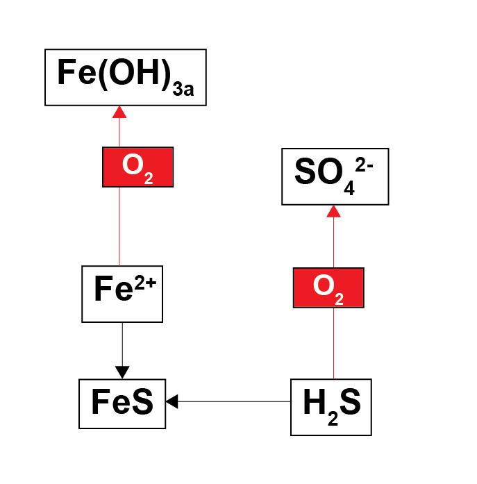
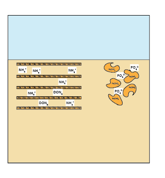

# Adjust key parameters

## Fe and SO42-

### Variables: Fe and SO42- 
### *aed_sdg_vars.csv*

Add higher concentrations of Fe(OH)3A and SO42- to the file aed_sdg_vars. Add them to the csv column ‘default_vals’, which sets the flux and concentration at the sediment-water interface. Set ‘feoh3a’ to 100.0E+03 (flux in mmol m-2 y-1) and ‘so4’ to 32.0E+03 (concentration in mmol m-3). Plot the output figures for ‘feoh3a’, ‘feii’, ‘so4’ and ‘h2s’. Also plot ‘ch4’ and compare its concentration to the previous example: the implication is that adding SO42- reduces the creation CH4. 

## Grid structure

### Parameters: maxnpts, job, xl
### *aed_candi_params.csv*

Use the parameter ‘job‘ to change the grid from fixed width (0) to exponentially increasing (2).

Use ‘xl’ to change the depth of the sediment simulated, from say, 10 cm to 40 cm.

Use ‘maxnpts’ to set the number of layers simulated. Note that job 0 requires maxnpts to be depth × an integer + 1.

Plot the grid profile by opening the folder 'R_Depths', then the project 'R_Depths', then the plotting script 'GridStructure.R'. With an even grid, the line will be a constant value down the y axis; with an exponentially increasing grid, the line will be increasing with depth.

## Depositional flux

### Parameter: w00
### *aed_candi_params.csv*

Set the deposition rate ‘w00’ to be large or small. Plot and save the results after each simulation.  

## Porosity

### Parameters: p0, p00, bp
### *aed_candi_params.csv*

Run two simulations with high and low porosity. p0 is the porosity at the sediment-water interface, and p00 is the porosity at the deep. You may find that extremes of porosity, the model experiences errors. 

Plot the porosity profile by opening the folder 'R_Depths', then the project 'R_Depths', then the plotting script 'Porosity.R'. 

## Organic matter model

### Parameters: OMModel1, OMModel2
### *aed_candi_params.csv*

### Variables: POML, POCL etc,
### *aed_sdg_vars.csv*

Change the organic matter model from the simple model to the mode complex model. Change the parameter ‘OMModel’ in aed_candi_params from 1 to 2. 

Add higher concentrations of the relevant variables: pocl, ponr, dopl etc. in the ‘default_vals’ column.

Plot these variables with the RStudio plotting script. Add pocl, ponr, dopl to the ‘files’ variable, towards the top of the script SixPlotsCandi-Examples.R.

## Organic matter limitation and inhibition

### Parameters: kpo2, kpno3 …
### *aed_candi_params.csv*

### Extra variables: FTEA …
### *aed.nml*

Adjust any of the limitation or inhibition constants. The parameters are named as ‘kpo2’, ‘kpno3’ etc. The units of the parameter are in concentration. 

You can create images of the limitation and inhibition by adding extra variables. Listed  these extra vairables in 'aed.nml', at the parameter ‘morevariables’. Examples include ‘FTEAO2’, ‘FINNO3’ etc. The resulting .sed files are saved in the Extras directory, in results/candi_aed/zone/Extras. Use the plotting script ‘SixplotsExtras.R’.

## Inorganic reactions

### Parameters: knh4ox
### *aed_candi_params.csv*

Change the parameter ‘knh4ox’ in aed_candi_params. This parameter controls the kinetic rate of NH4+ oxidation to NO3- by O2. The plots should show different amounts of O2, NH4+ and NO3-. 

## Adsorption

### Parameters: NH4AdsorptionModel, knh4p, DOMAdsorptionModel, kdomp, PO4AdsorptionModel, kpo4p, ads_use_pH 
### *aed_candi_params.csv*

Change the switches to turn adsorption on, then adjust the adsorption coefficients to change the degree of adsorption, then plot the relevant state variables.

## Bioturbation and irrigation

### Parameters: imix, DB0, xs, α0, xirrig
### *aed_candi_params.csv*

Change the bioturbation and irrigation parameters. There may be a point where the model stops working, due to, for example, too little mixing, or sharp concentration gradients. Plot the shapes of the profiles from the Depths.R.

Plot the bioturbation and irrigation profiles by opening the folder 'R_Depths', then the project 'R_Depths', then the plotting scripts 'Irrigation' and 'Bioturbation'. You can also plot the time-sensitive changes of bioturbation and irrigation using 'Extras__SixPlotsCandi-Examples.R', plotting the variables named 'bioturbation' and 'cirrig'. 

## High salinity

### Parameters: Sal1, Sal2, kh2s
### *aed_candi_params.csv*

### Variables: salinity, so4
### *aed_sdg_vars.csv*

To create a hypersaline lagoon, increase the 'default_vals' value for 'salinity' from 33 000 to 66 000. Increase 'so4' to 60 000 mmol m^-3.
Note that 'Sal1' and 'Sal2' are set to 35 and 70 (ppt). 'kh2s' is set to 100 mmol L^-1. Plot 'so4', 'salinity' and 'h2s' and compare them to the previous simulation results. Also plot 'bioturbation' and 'cirrig' using 'Extras__SixPlotsCandi-Examples.R'. Change the sulphide sensitivity parameter 'kh2s' and observe the effect on 'FSul' and bioturbation. 

