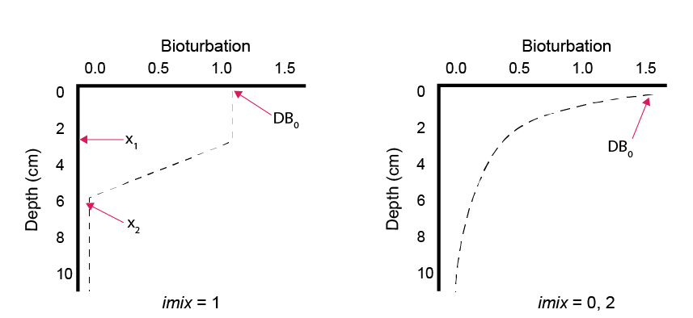

# Mass conservation check

This folder outlines a method for ensuring that a simulation is conserving mass in the upper layers of the sediment. The boundary concentrations and fluxes are compared with what accumlates in the sediment layers. 

After showing how to set it up so that it works, a number of exercises are listed to demonstrate ways that the model can have errors. These can be through numerical errors or chossing the wrong settings. 

At the end you should have a method for ensuring model accuracy, which should be good practice for any new simulation. 

## Approach
A non-reactive solid and a non-reactive solute are introduced at the sediment-water interface (SWI) as 'tracers'. As they enter at the SWI, the tracers' fluxes and concentrations are converted to mass units, per 1 m^2. The concentrations in the sediment are similarly summmed per 1 m^2, across all depths. 

The simulation allows half a year of model time for the model to spin up, then the tracers are introduced at the SWI for one year, then the model continues to run without them. 

The plotting script displays the mass of the incoming and accumulated tracers (per m^2). Even with the best setup, there can be a difference of approximately 10% in the calculated mass of either tracer.

## Setup

### Time parameters 

In 'aed.nml', adjust the time settings as follows:

- 'substep_0' = 72 (hours per timestep). This is the substep until 'firststeps'.
- 'substep_1' = 48 (hours per timestep). This is the substep after 'firststeps'. 
- 'firststeps' = 0.5 (years). This is the time when the substep changes to 'substep_1'. We will set this to coincide with the input of tracers.
- 'timeswitch' = 2 (integer switch). This setting allows the substep settings above to function.

### SWI settings

In 'aed.nml' adjust the settings as follows:

- 'swibc_mode' = 10 (integer switch). This parameter sets the boundary to the file listed in 'swibc_file'.
- 'swibc_file' = 'swibc.dat' (filename). This is the name of the sediment-water interface boundary condition (SWIBC) file in the aed_sdg folder.
- 'swibc_filevars' = 'pomspecial', 'n2' (variable names). These are the variables that will be taken from the swibc file in this simulation. 

In 'aed_candi_params.csv' set

- 'OMModel' = 1 (integer switch). 
- 'pomspecial2dic' = 0 (y^{-1}). This makes the 'pomspecial' that fluxes in unreactive.

Use the file 'swibc.dat'. Note that the 'pomspecial' flux is 1.0E-08 (mmol m^{-2} y^{-1}) and the 'n2' concentration is 1.0E-08 (mmol m^{-3}) for most of the simulation. The model converts the concentration from mmol m^{-3} to mmol L^{-1}, but check that your plot corresponds with this. 

At time 183 days (or 0.5 years) the flux and concentration increase to 1.0E+02 (mmol m^{-2} y^{-1}) and 1.0E+05 (mmol m^{-3}). At 548 days (or 1.5 years) the flux and concentration return to the very low number. 

### Grid settings

In 'aed_candi_params.csv' set

- 'job' = 0 (integer switch). This has an evenly-spaced grid.
- 'p0'  = 0.5 (fraction between 0 and 1). This is the porosity at the sediment-water interface.
- 'p00' = 0.5 (fraction between 0 and 1). This is the porosity at depth. These porosities are set to be the same, which gives the most reliable results.
- 'imix' = 2 (integer switch). This sets bioturbation to have exponential decay rather than the sharper cutoffs with 'imix' = 1.
- 'maxnpts' = 41 (layers). This is adequate for the simulation but it can be increased. Remember to have it as a multiple of the depth (cm) + 1 layer (for the zeroth layer), for example, 81, 201 or 401.
- 'xl' = 20 (cm). This depth is adequate for this simulation.
- 'xirrig' = 3 (cm). This is the depth of irrigation.
- 'xs' = 5. This sets the shape of the decay curve for bioturbation. 

## Plotting

Use the plotting script 'SixPlotsCandi-Examples.R' and make the multi-panel plot for variables 'n2' and 'pomspecial'. Pay attention to the mass plot. The red line is the result of accumulated mass calculated from the influx of the tracer. The brown columns are the cumulative mass. They are set to be plotted on the same axes, so the lines should correspond.

## Generate errors

This section lists ways to show how a mass error can be created. These are pitfalls that you can avoid when you set up a simulation. Change these settings, then run the model again, then make a plot.

### Bioturbation at two depths

Change the parameter 'imix' from 2 to 1. This sets bioturbation to have linear steps. Set 'x1' to 2 (cm) and 'x2' to 4 (cm). This may produce a good mass result. Tune the parameters until the mass balance worsens.

### High porosity

Set both 'p0' and 'p00' to 0.75. This should result in a good solid balance but a higher sediment mass than influxed mass for solutes.

### Low porosity

Set both 'p0' and 'p00' to 0.25. This should result in a good solid balance but a lower sediment mass than influxed mass for solids.

### Porosity gradient

Set 'p0' to 0.9 and 'p00' to 0.5. This should result in less sediment mass than influxed mass for both solids and solutes.

